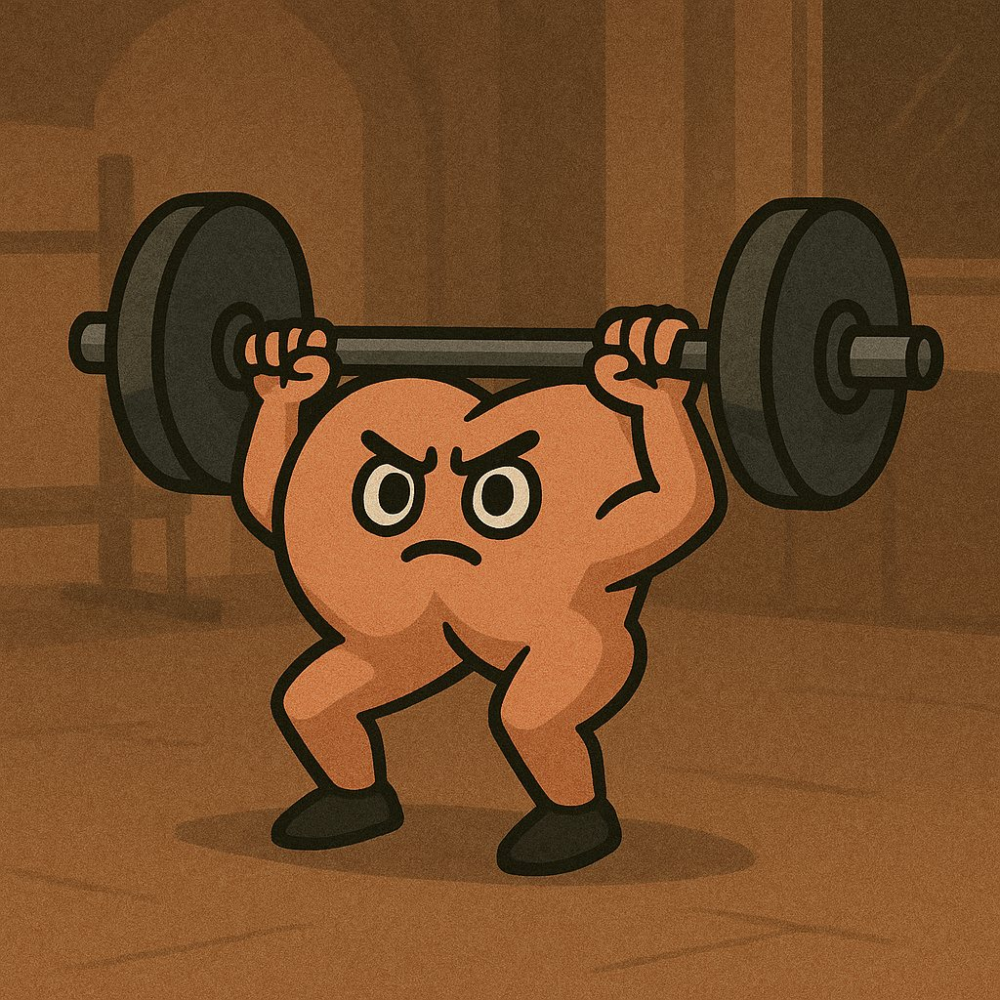

하체 운동을 몇달 동안 굉장히 조심조심 기구 위주로 하던 와중에 오랜만에 바벨 스쿼트를 했다. 프리웨이트는 오랜만이었는데, 요즘 헬스장에서 스파이처럼 몰래몰래 운동 영상 찍기에 재미가 들려 스쿼트도 찍어보다가 벗윙크를 발견했다.

가동 범위를 욕심내 깊이 앉으려고 했던 게 문제였나 싶어서, 바벨을 내려놓고 맨몸 스쿼트를 반복하면서 느낌에 집중했다. 고관절이 딱 열리면서 으악!! 하는 느낌을 찾아 그 자세에서 펄스 동작을 짧게 반복했는데, 어느 순간 이거다, 싶은 구간이 있었다. 그 느낌 그대로 다시 바벨 올려서 다시 시도.

가볍게 천천히, 머리 속으로 생각하고 집중하는 것만으로 이렇게 다르다.

완벽하진 않지만 벗윙크가 많이 사라졌다.

이 과정을 겪으며 문득 학교에서 배웠던 인지심리학 개념이 떠올랐다. 나는 거의 모든 상황에서 ‘어떻게 해야 하지?’라는 생각으로, 태스크 위주로 (top-down processing) 먼저 움직이려 하고, 실제로 몸이 느끼는 감각(bottom-up input)은 무시할 때가 많다. 그러다 어딘가 고장이 난다. 그런데 수의근은 실제로 뇌의 명령으로 움직이는 거라, 감각과 지각이 먼저 올바르게 작동해야 근육도 올바른 방향으로 반응할 수 있다. ‘이렇게 하면 되겠지’가 아니라, ‘이렇게 느껴지는 게 맞는 거야’하는 지각이 선행되니 수행이 따라왔다 (perceptual-motor loop). 이걸 가능하게 해준 게 맨몸 연습과 영상을 복기하는 거였던 거고.

이 이후로 2-3주간 하체 운동에 재미가 들려 신나게 빡세게 했었는데, 욕심 내다가 몬스터 글루트에서 부상을 입어 하체운동을 일주일 쉬었다. 치료 받고 얼른 또 하고 싶은데... 다시 또 뇌부터 톡톡 살살 깨워가며 해봐야지🦵🏻

