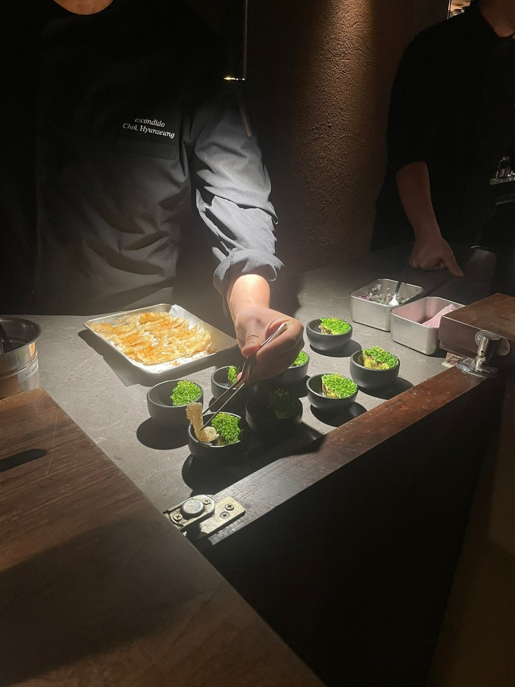
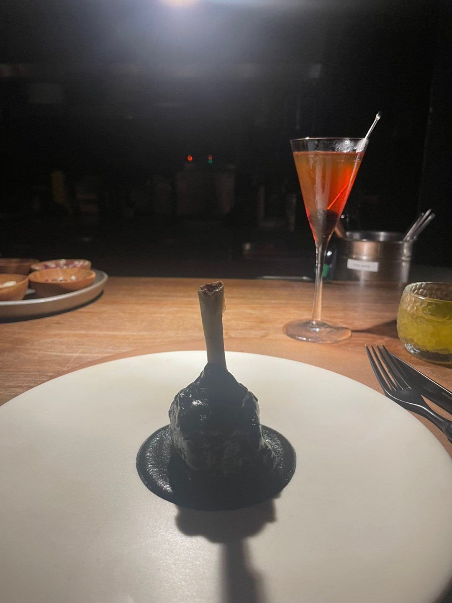

갑자기 뭔가에 휘리릭-! 꽂혀서 전부터 가보고 싶었던 에스콘디도를 친구와 예약했다.

내 돈으론 부담스러워서, 친구랑 붓는 계로 가고 싶었음

(사실 이것도 내 돈이지만 과거의 내가 축적해 뒀던 거라 이번 달이나 다음 달의 내가 고생하지 않아도 되니깐 개이득)

저녁 식사가 1부, 2부로 나뉘어 운영되어 2부로 예약했는데,

마침 이번 주에 일이 많아 야근하다가 아주 조금 여유 있게 도착했다.

사실 파인다이닝이야 전보다 많이 대중화된 키워드지만, 사실 그 정체를 정확히는 모르겠기도 하고??

게다가 멕시코 음식을 좋아하긴 해도 파인다이닝으로 해석한 건 먹어본 적이 없어서 너모너모너모 기대가 됐다.

직원마다 옷에 이름표를 달고 있는 게 좋았음.

본인의 이름과 자부심을 걸고 하는 일이고,

이름을 실로 박아뒀는데 이거도 다 따지고 보면 비용이고 이 직원이 퇴사하면 폐기물이 되는데,

세심한 부분까지 케어한다고 느껴졌고 인상 깊었다.

나는 가끔 이렇게 사소하고 별 쓸데없는 거에 집착해.

아쉬웠던 부분도 있었지만, 해산물을 많이 먹을 수 있어서 좋았고 '몰레'라는 소스가 너무 맛있어서,

특히 춘장처럼 생긴 까만 몰레가 너무 맛있어서!!!! 캐치테이블에 열심히 리뷰도 남겼다, 다시 가보고 싶어서 헤헤😛

에스콘디도에서 제공하는 것들을 최대한 많이 경험해보고 싶어서 칵테일 페어링 코스를 함께 주문했는데,

첫번째 칵테일을 제외하고 나머지 4개는 다 마시기가 힘들었다 (알쓰라서)

메즈칼이나 데낄라 같은 독주가 들어가서 알콜향이 많이 났고, 특히 그 중 하나는 알콜향도 강한데 맵기도 매웠다😱

매워서 혼났고, 칵테일 준비해주시는 분이 새 칵테일 준비해주실 때마다 죄송해서 마음이 좀 불편했다.

지금 생각해보면 한번 여쭤볼걸, 알콜향이 좀 힘든데 혹시 다른 비율이나 음료로 대체가 가능할지...!?

그래도 코스 여기저기 고수가 많이 들어가서 나는 신났고!

마지막에 디저트로 나온 데낄라 아이스크림에 라임즙 톡톡, 요게 완전 킥...!

까만 몰레랑 요 아이스크림이 가장 기억에 남는다.
에스콘디도 쉐프님이 다른 멕시칸 음식점도 운영하신다고 들어서 다른 곳들도 가보고 싶어졌다.

글을 쓰고 저장해둔 사이 7월 말에 또다른 곳이 가오픈해벌임.

좋은 음식을 친구랑 먹어서 저녁 먹다가 엄빠가 생각났는데,

아마 가격에 미쳤다고 할 거라서 성수동에 있는 곳으로 먼저 모시고 다녀와봐야겠다.

그리고 이날 밥 잘 먹고 집에 와서 잠들었다가 불편한 꿈을 꿔서,

꿈에 나온 엄마한테 맘이 불편하다고 얘기했더니

엄마가 본인처럼 정확하고 대장부답게 얘기해줘서 사무실에서 혼자 낄낄낄 웃었다.

돈 많이 벌어서 좋은 데 많이 데려갈게💭
