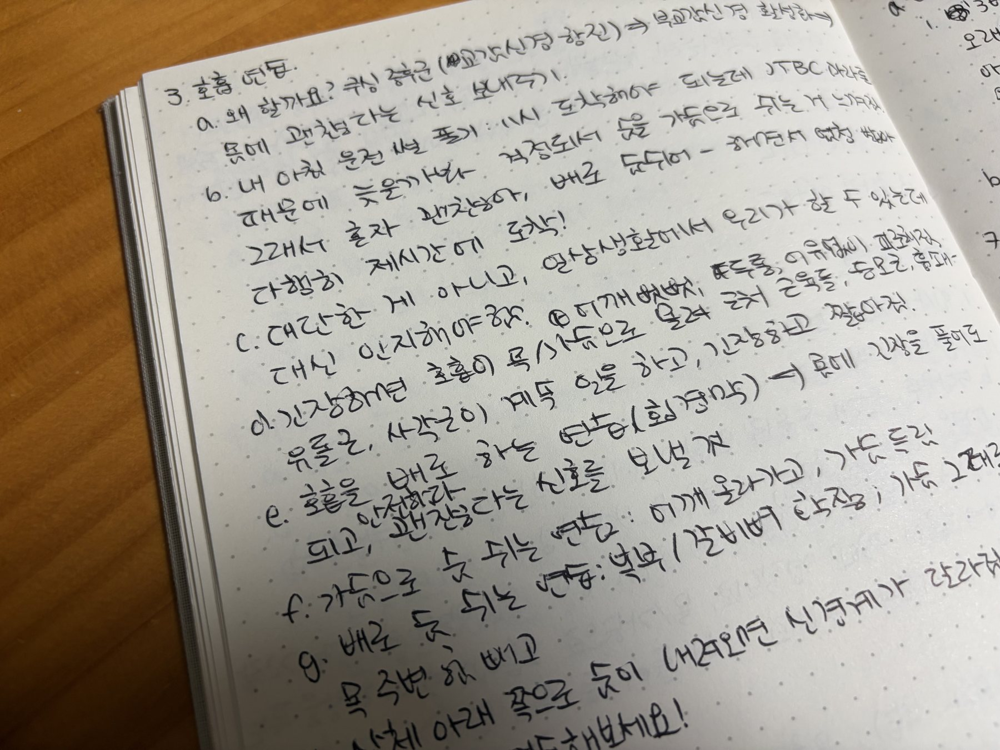
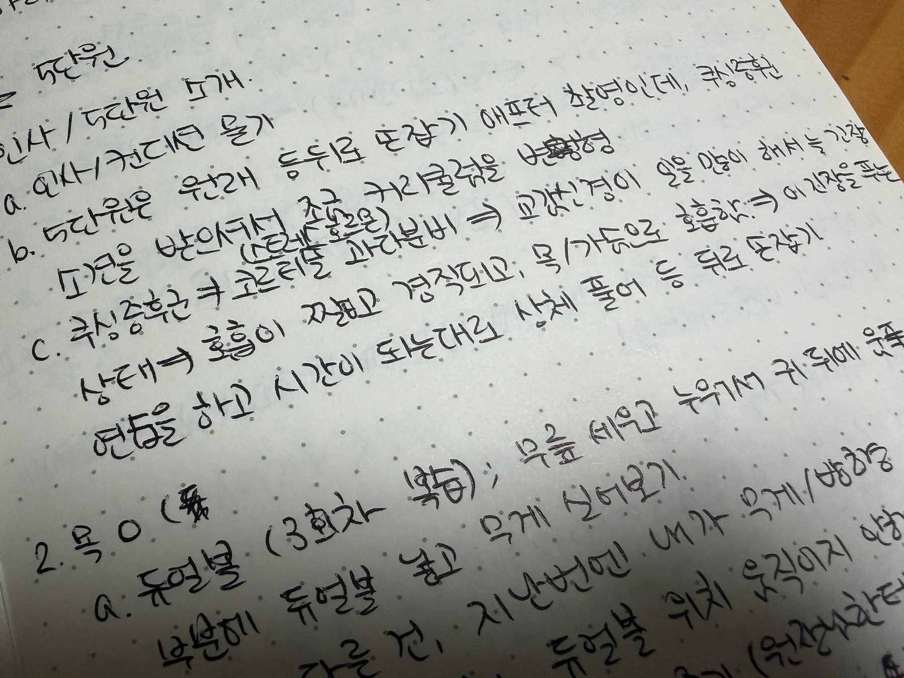
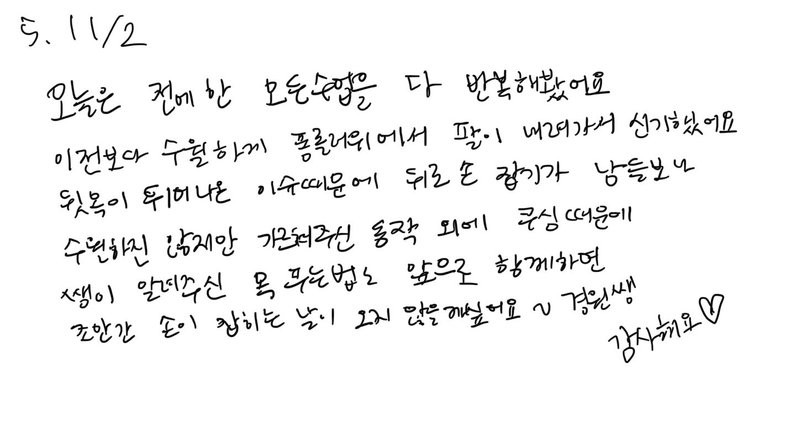

뉘트에서 강사 생활을 갓 시작했지만

2025년 마지막 몇달을 복기해 귀한 시간을 내어 찾아주신 회원분들을 떠올려본다.

대부분 기억에 남는 회원을 떠올리면 변화가 눈에 보이게 컸던 경우일 거다.
체중이 많이 줄었다거나,
통증이 사라졌다거나,
못 하던 동작을 하게 됐다거나.
그런데 내 기억에 남은 회원은 내가 도와줄 수 있는 게 많지 않았다고 느꼈던 분이다.

처음으로 개인 수업을 진행했던,
수업을 잘 따라와 주셨던 여자회원분이었는데 나도 그분과 수업하는 시간이 즐거웠다.
다만 몸에 긴장이 너무 많다는 게 유독 느껴졌었다.
본인도 인지하고 있음에도 불구하고,

동작 하나를 할 때도 힘이 먼저 들어가 있었고 호흡이 얕았다.

그런데 또 막상 큐잉을 하고, 집중할 부분을 알려드리면 금방 몸이 노골노골해지던 분.
그러던 분이 나와 수업을 하던 몇주간 개인적으로 일련의 사건사고를 겪었고,

상급 병원에 다녀와 진단 결과를 이야기해 주셨다.
**쿠싱 증후군.**
쿠싱 증후군에 대해 깊이 알고 있지 못했는데, 의사 선생님의 소견은 분명했다.
당분간 운동 중단.
지금 생각해도 가장 크게 남았던 감정은 아쉬움이다.
운동을 아무것도 안 하는 게 이 분께 정말 도움이 될까?
그리고 이 상황에서 내가 할 수 있는 게 아무것도 없는 걸까?

불행인지 다행인지 마지막 수업 전에 진단 결과를 알려주셔서,
짧은 시간 안에, 최대한 쿠싱 증후군에 대해 이해해보려 했다.
무언가를 “고쳐주고 싶다”기보다는,
적어도 이 몸이 왜 이런 상태에 있는지,

이게 도대체 어떤 질환이길래 사람을 괴롭게 하는지 이해하고 싶다는 마음이 더 컸다.
그래서 짧은 시간 동안 쿠싱 증후군에 대해 공부하는 과정에서 반복적으로 마주친 키워드가 있었다:

- 스트레스
- 코르티솔
- 자율신경계
- 부교감신경

핵심은 몸을 더 쓰게 만드는 게 아니라,
몸이 스스로 긴장을 내려놓을 수 있는 상태를 만드는 것에 가까웠다.

## '운동'보다 '호흡'

마침 이 지점은 뉘트에서 중요하게 다루는 영역이기도 해서 급하게 수업 방향을 바꿨다.

동작을 반복하고 늘리기보다는 호흡을 느끼는 시간을 늘렸고,
힘을 주기보다는 힘이 빠지는 감각을 함께 살폈다.
어쩌면 일반적인 운동 수업보다, 평소의 뉘트보다도
훨씬 조용하고, 움직임이 적은 시간이었을지도 모른다.

그럼에도 그 시간이, 그런 알아차림이 그분의 몸에 필요하다고 생각해

마지막 수업에서 몸의 감각에 집중하며 각각 다른 부위로 호흡하는 방법을 연습했고,

목 뒤쪽에 위치한 후두하근 위주로 긴장을 푸는 방법으로 수업을 대체했다.

감사하게도 회원님이 마지막 수업 후

쿠싱 증후군에 대해 수업을 준비해줘서 고맙다는 후기를 남겨주셨다.

운동을 더 계속 함께하지는 못했고, 의사의 판단을 존중해 수업은 중단됐다.

그래서 여전히 “내가 뭘 더 해줄 수 있었을까”라는 아쉬움이 남아 있다

(내가 의사 말 안 듣고 운동을 하는 사람이라 더 그렇게 느낄지도😅)
그리고 이 회원님과의 수업을 되돌아보며 최근 내 운동 경험과 겹치는 부분도 있다는 걸 알게 됐다.

깨달음! 알아차림...!

## 크로스핏, 웨이트, 그리고 뉘트

요즘 시간을 내어 크로스핏과 웨이트, 그리고 뉘트를 병행하고 있다

(가끔 한국무용도 배우러 간다💃🏻)

서로 성격이 완전 다른 운동이지만 이 셋이 서로를 보완하고 있다는 걸 몸으로 자주 인지한다

(특히 요즘 크로스핏과 웨이트도 정말 다르다는 걸 느껴 혼란을 종종 느낀다😓)

그래도 구분을 하자면,

크로스핏과 웨이트는 몸을 쓰는 방법을 확장한다.

힘을 내 버티고, 한계에 도전해 뛰어넘게 만든다면,

뉘트는 몸을 내려놓는 방법을 가르쳐준다.

호흡, 뼈와 뼈 사이의 공간, 긴장과 이완의 균형.

셋의 공통점은연습과 반복을 통해 전엔 하지 못하던 걸 하게 해주고,

그로 인해 자기효능감을 느끼게 된다는 거.

한쪽만 하면 언젠가 몸에 무리가 오고,

또 한쪽에 치우치면 내가 지향하는 절제,

스스로 밀어부치는 discipline에 부합하지 못한다.

힘만 키우면 몸은 계속 긴장한 상태가 되고,

풀 줄만 알면 힘을 써야 할 순간에 취약해진다.

운동은 항상 더 강해지기 위한 수단이 아닐 수도 있다.

어떤 시기에는 회복을 배우는 과정일 수도 있고,

몸의 신호를 다시 읽는 시간일 수도 있다.

그 회원분한테는 후자가 더 필요한 순간이었겠지.

그 과정을 함께할 수 있게, 조금 더 강하게 주장했다면

지금 더 건강한 모습으로 같이 운동할 수 있었을까?

의문과 아쉬움을, 또 소중한 배움이 있게 해준 회원분이라

나중에 또 인연이 닿는다면 건강한 삶을 영위할 수 있게 어떤 도움이라도 드리고 싶다.

## 모순을 수용한다

스스로를 모순이 많은 사람이라고 생각한다.

I인데 편한 친구들 앞에선 E처럼 행동하고,

크로스핏처럼 왁자지껄 으쌰으쌰하는 운동을 하면서도

너무 끈끈하게 어울리는 분위기는 부담스러워서 지금 다니는 박스가 좋다.

함께 운동은 하지만, 예의는 지키고 응원하되 과하게 섞이지 않는 거리.

소개팅도 들어오는대로 거절하지 않고 받지만

막상 약속 시간이 가까워지면 도살장에 끌려가는 소처럼 가기 싫어짐.

아무튼 이거 말고도 스스로 이거 좀 모순인데?? 싶은 순간들이 있음.

이 모순을 은근히 즐긴다😃

위에서도 얘기했지만 크로스핏과 웨이트는 몸을 밀어붙이게 만든다.

다른 사람과 서로 응원하고 함께 해낸다는 성취감에 아드레날린이 폭발한다.

뉘트는 몸을 내려놓는 방법을 가르쳐준다.

호흡, 공간, 혼자 집중하는 시간.

둘은 반대처럼 보이지만 서로를 완벽하게 보완한다.

나는 여전히 격한 운동도 하고, 조용한 운동도 한다.

혼자 집중하는 시간을 좋아하면서도

사람들 사이에 있고 싶어 하기도 한다.

예전 같았으면 이건 한쪽으로 교통정리를 해야 할 문제라고도 생각했겠지만,

이젠 그럴 수도 있지 뭐... 내가 요즘은 이렇게 생겨먹었네- 하고 말아버린다🤷🏻‍♀️

그리고 이런 생각을 한다.

운동도 마찬가지로, 정답 하나로 수렴하지 않아도 된다고.

꼭 한 방향으로 나아갈 필요도 없고,

그때그때 나한테 필요한 것을 알아차리고

어떤 방향으로든 나아가기만 해도 몸에는 땡큐베리마치인 것🙏🏻

사람도, 몸도 원래 모순적인 동시에 상호보완적인 존재인 것...!

그러니까 그럼에도, 사람은 원래 그런 거니까,

내 주위 가족, 소중한 친구들이 2026년에는 숨쉬기 말고,

아주 조금만 더 운동하면서 즐겁고 건강하게,

반짝반짝 빛나는 한해를 모두 보낼 수 있길✨🐎
