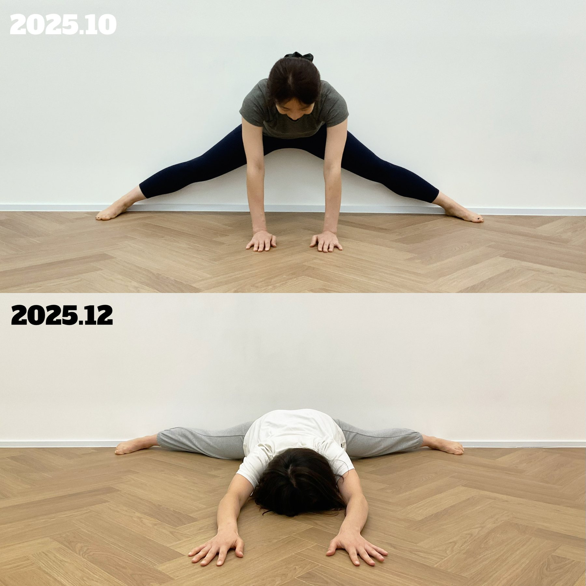
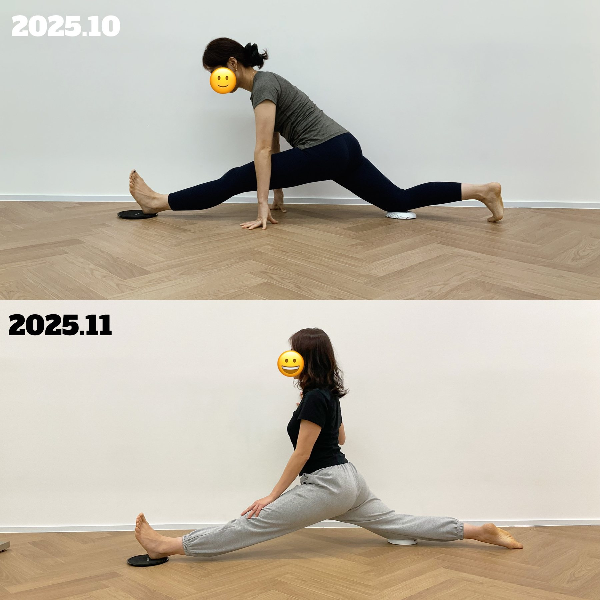
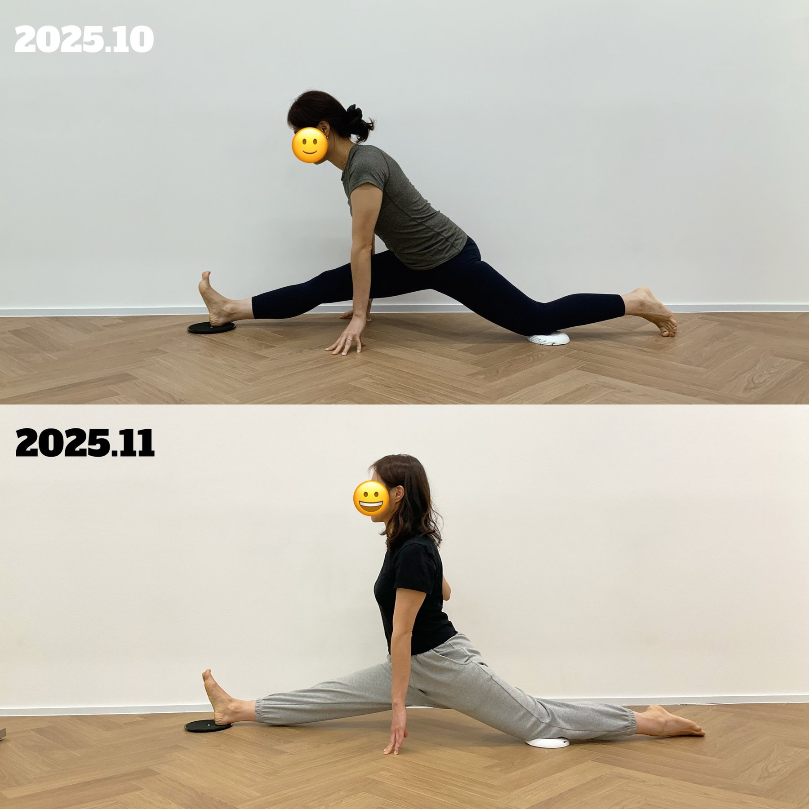

작년 연말에 뉘트에서 8주 다리찢기 챌린지가 모집됐고,
그중 5–8주차 후반부 수업을 담당했다.
다리찢기를 성공한 회원 중 한 명은 전에 같은 직장에서 근무하던 친구다.
아마존에서 같이 일했던지라 나 혼자 이 친구를 ‘정글의 짝꿍’이라고 부른다 ㅋㅋ
회사 다닐 때도 그렇고, 내가 뉘트에서 강사 생활을 시작했을 때도,

내가 어떤 일을 하던지 항상 진심으로 응원해주는 친구.
그래서 이번 챌린지에 참여한다고 했을 때 괜히 더 반갑고 고마웠다.
이 친구는 원래 요가를 꾸준히 해와 유연성 자체가 나쁜 편은 아니어서
다리찢기 성공을 “내가 만들어냈다”라고 말하긴 어렵지만,

내가 맡았던 후반부 수업에서는:

- 앞뒤, 양옆 다리찢기에 필요한 각각 부위들의 긴장을 풀고
- 약한 부위는 맨몸으로 힘을 길러주고
- 다리찢기에 필요한 동작들을 무한 반복

이미 되는 동작들을 조금 더 편하게, 조금씩 가동범위를 늘리도록 반복했다.
이미 할 수 있는 몸을 덜 긴장한 상태로 쓰게 만드는 정리 작업에 가까웠고,
이때의 결과는 이 친구의 몸, 그동안 쌓아온 연습,
그리고 마지막 몇 주의 흐름이 같이 만든 결과인 것 같다.

정글에서 같이 버티던 짝꿍이 다리찢기를 해내는 걸 보니
괜히 내가 더 뿌듯했던 경험...!

1월 말부터는 어깨펴기 챌린지를 첫주부터 이끌어나갈 예정이라

이번에는 어떤 변화가 생길지 슬쩍 몰래 또 기대중.
